# Challenger Model Benchmarking & Data Leakage Audit

A credit-risk modeling project comparing a Logistic Regression baseline with an XGBoost challenger while demonstrating how post-approval information can cause data leakage and artificially inflate model performance.

## Project Overview

In credit risk modeling, a model should only use information that would be available when the credit decision is made.

This project has two main objectives:

- Benchmark a Logistic Regression baseline against an XGBoost challenger.
- Demonstrate how a simulated post-approval variable can create data leakage and inflate model performance.

The focus is on model validation, leakage detection, evaluation metrics, and basic model explainability.

## Dataset

The project uses the German Credit dataset from OpenML (`credit-g`).

- 1,000 observations
- 20 original predictors
- 1 target variable
- `bad = 1`
- `good = 0`

Categorical variables are one-hot encoded before modeling.

The encoded dataset contains approximately 48 predictor columns. A simulated `dpd_30_plus` feature is added temporarily for the leakage experiment.

## Exploratory Data Analysis

### Class Distribution

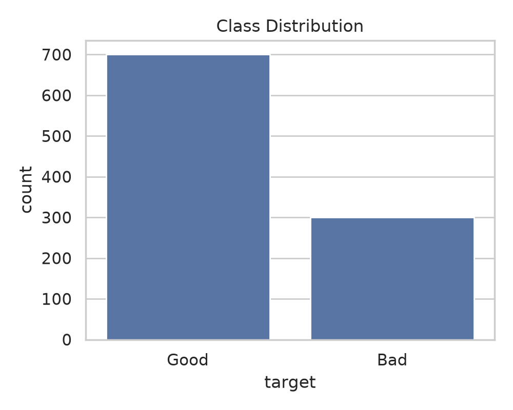

### Numerical Feature Distributions

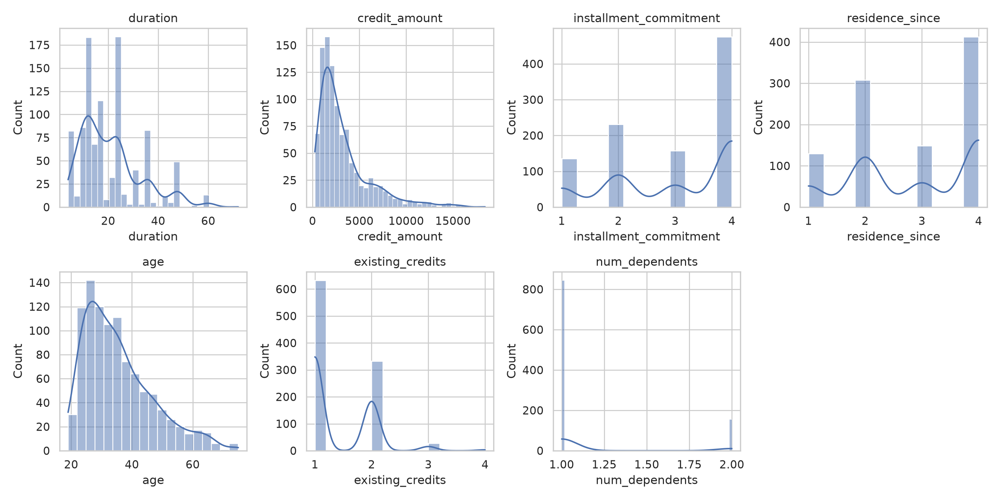

### Numerical Correlation

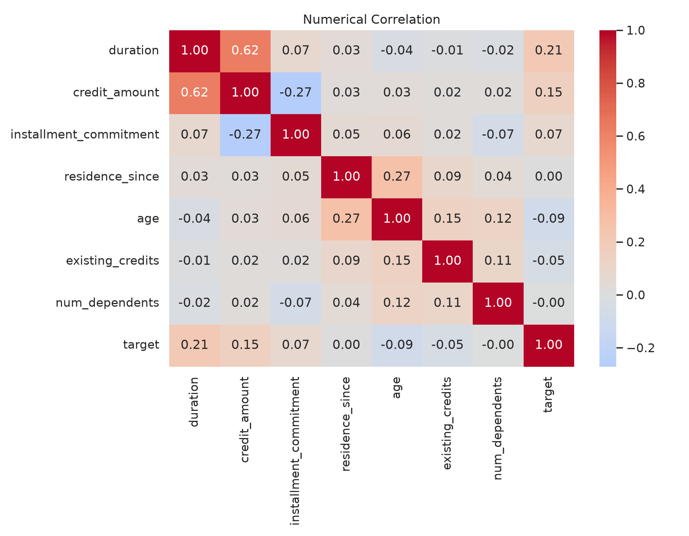

### Selected Feature Relationships

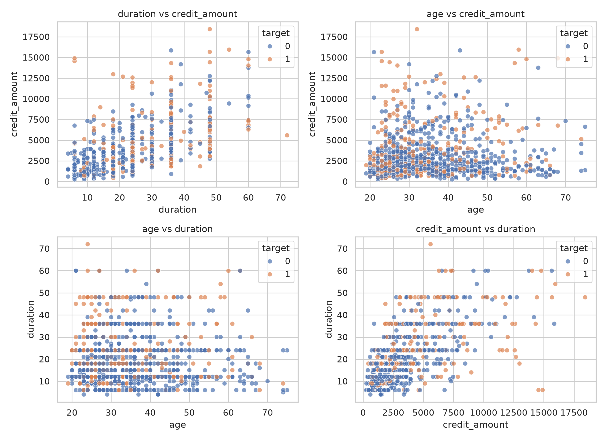

### Full Encoded Feature Correlation

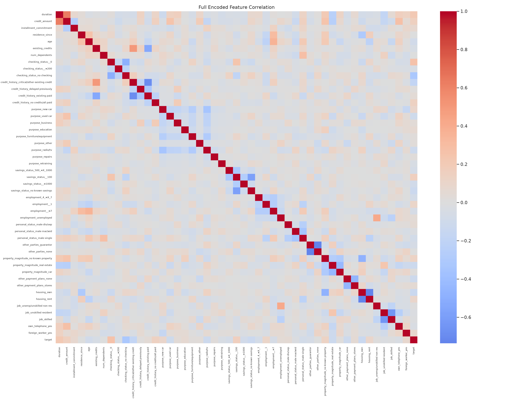

The full encoded heatmap is shown without annotations because the large number of encoded variables would make individual correlation values difficult to read.

## Data Leakage Audit

### What is `dpd_30_plus`?

`dpd_30_plus` represents whether a borrower became 30+ days past due.

This variable is **simulated for this project**. It is not an actual timestamped repayment field from the German Credit dataset.

The assumption is that 30+ days past-due information becomes available after the original credit decision.

### Why is this leakage?

A credit decision should only use information available at the decision point.

For example:

```text
Credit application
       ↓
Credit decision
       ↓
Loan repayment
       ↓
30+ days past due
```

Using the final information to predict the earlier decision would give the model access to future information.

The simulated feature was intentionally correlated with the target to demonstrate this effect.

In the recorded run:

- Logistic Regression with leakage: **ROC-AUC 0.984**
- Clean Logistic Regression: **ROC-AUC 0.812**

The leakage feature was removed before the final baseline-versus-challenger comparison.

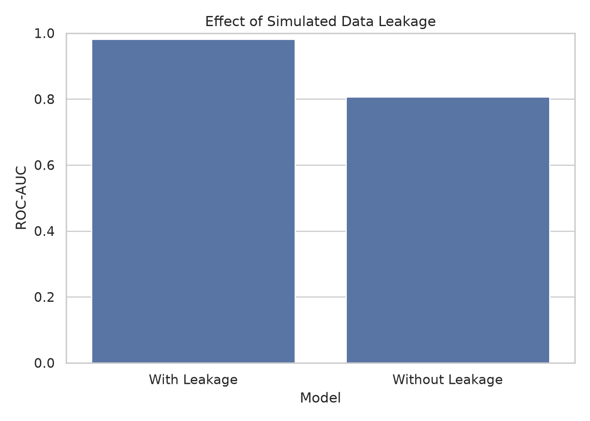

## Modeling

### Logistic Regression Baseline

Logistic Regression was selected as the baseline because it is simple, fast, and relatively easy to interpret. It provides a useful reference point for evaluating whether a more complex model provides additional predictive value.

### XGBoost Challenger

XGBoost was selected as the challenger because boosted trees can capture nonlinear relationships and feature interactions.

The project does not assume that the challenger must outperform the baseline. The models are compared using the same held-out test set.

### Hyperparameter Tuning

XGBoost was tuned using:

- GridSearchCV
- 5-fold StratifiedKFold
- ROC-AUC scoring

The test set is kept separate from GridSearch and is used only for final evaluation.

Recorded best parameters:

```text
learning_rate = 0.03
max_depth = 2
n_estimators = 200
```

Best cross-validation ROC-AUC:

```text
0.772
```

## Model Performance

Results from the recorded run:

| Metric | Logistic Regression | XGBoost Challenger |
|---|---:|---:|
| ROC-AUC | 0.812 | 0.782 |
| Gini | 0.625 | 0.563 |
| KS | 0.532 | 0.432 |
| Precision | 0.671 | 0.627 |
| Recall | 0.522 | 0.356 |
| F1 | 0.588 | 0.454 |

For this particular held-out test set, Logistic Regression produced higher measured scores than the tuned XGBoost challenger.

This result is treated as an experimental finding rather than a general claim that Logistic Regression is always better than XGBoost.

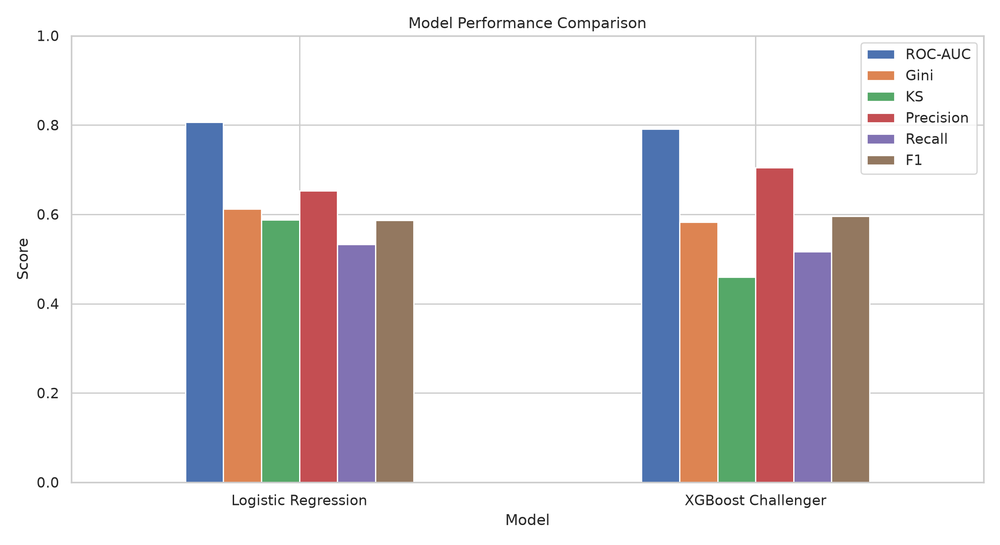

## Model Evaluation

### ROC Curve

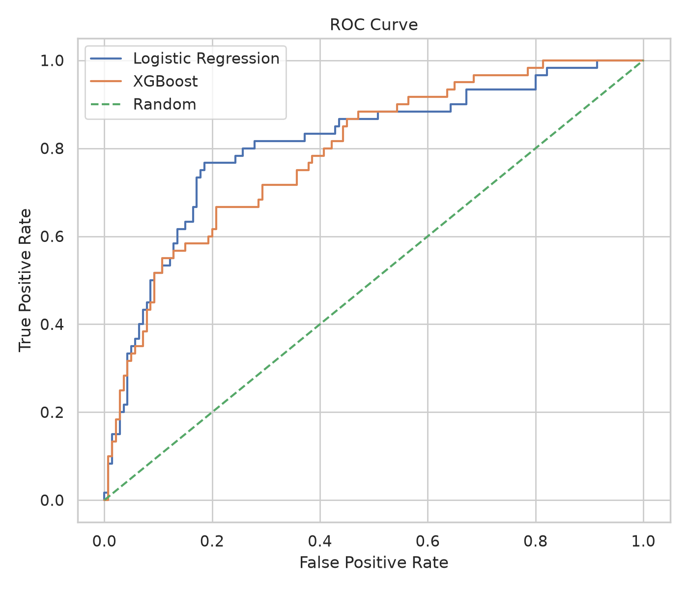

ROC-AUC evaluates how well the model separates the two classes across classification thresholds.

### Precision-Recall Curve

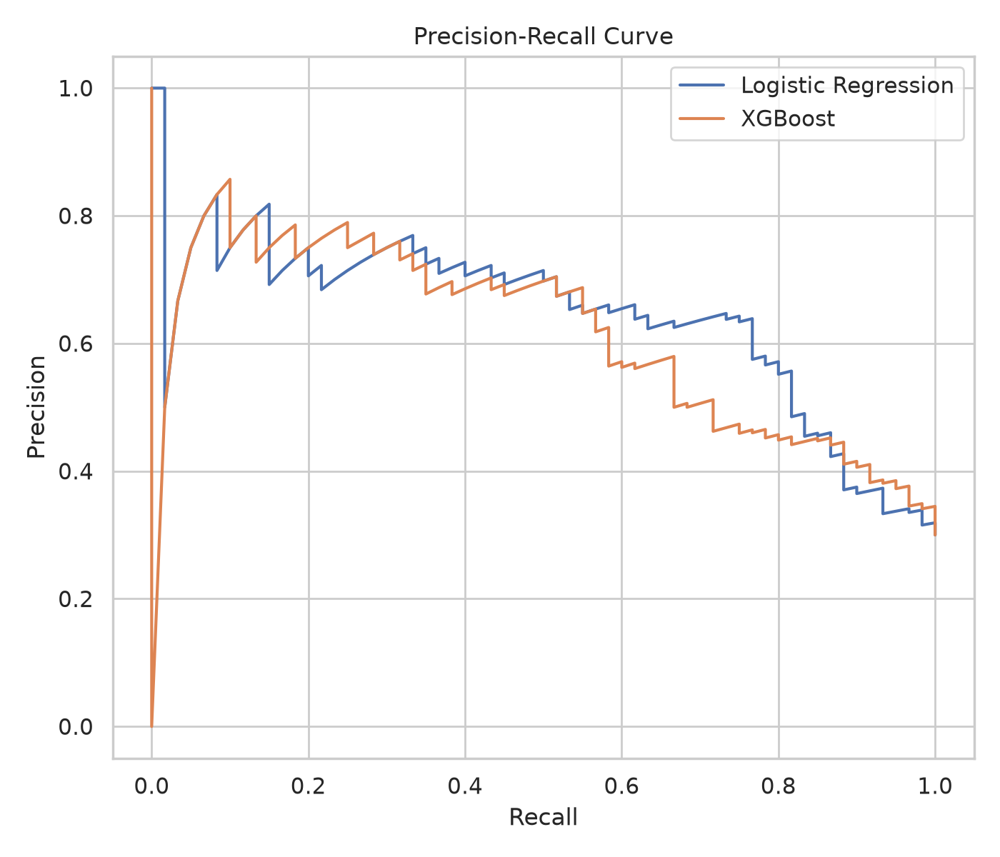

The Precision-Recall curve shows the trade-off between precision and recall at different thresholds.

### Confusion Matrices

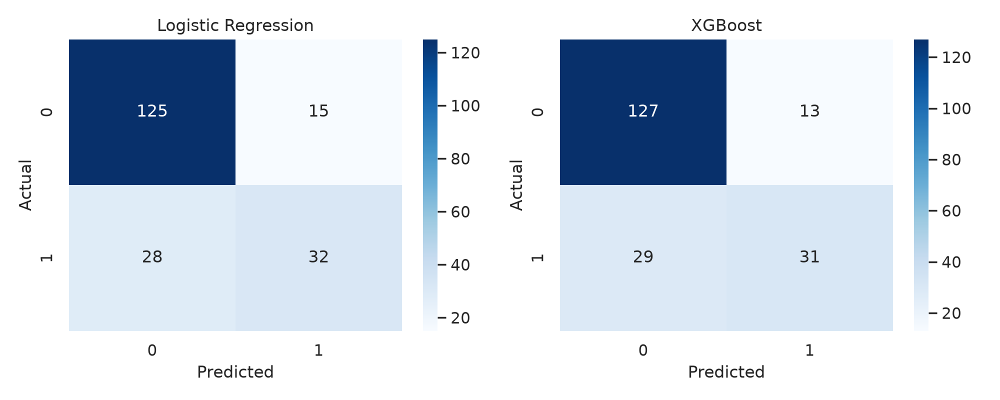

The confusion matrices show true positives, true negatives, false positives, and false negatives.

The project uses a 0.5 threshold for demonstration.

## Gini and KS

### Gini

Gini is derived from ROC-AUC:

```text
Gini = 2 × ROC-AUC - 1
```

For the recorded Logistic Regression result:

```text
Gini = 2 × 0.812 - 1
     ≈ 0.625
```

### KS

The Kolmogorov-Smirnov statistic measures the maximum separation between the predicted-score distributions of the two classes.

It is commonly used when evaluating credit-risk models.

## Explainability

SHAP is used to inspect which features contribute to the XGBoost model's predictions.

The SHAP summary plot provides a view of feature importance and the direction/magnitude of individual feature contributions.

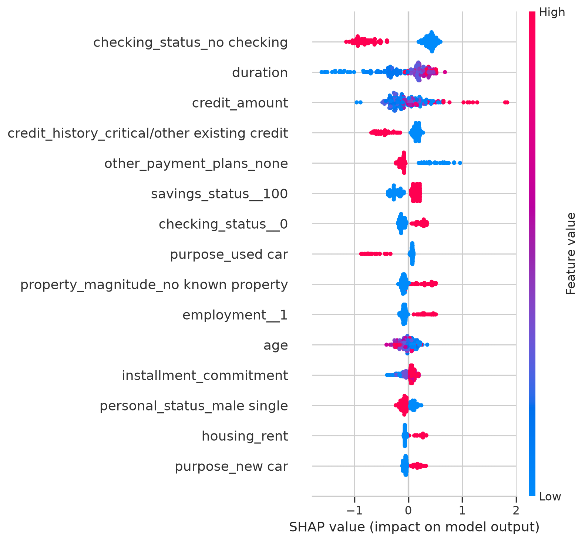

## Key Findings

1. The simulated `dpd_30_plus` feature produced a large increase in Logistic Regression ROC-AUC, demonstrating the effect of future information leakage.
2. Removing the leakage feature reduced the apparent performance.
3. Logistic Regression achieved ROC-AUC 0.812 in the recorded test run.
4. The tuned XGBoost challenger achieved ROC-AUC 0.782.
5. XGBoost did not provide predictive improvement over the Logistic Regression baseline in this experiment.
6. A more complex model should be evaluated on unseen data rather than being assumed to be better because it is more sophisticated.

## Limitations

- The dataset contains only 1,000 observations.
- It is a public educational dataset.
- The leakage variable is simulated rather than obtained from a real production system.
- The dataset does not contain real feature-creation timestamps.
- There is no external validation dataset.
- The 0.5 classification threshold is used for demonstration.
- The hyperparameter search is intentionally small.
- No production monitoring or deployment is implemented.
- No actual regulatory adverse-action code generation is implemented.
- The project does not claim regulatory compliance or production approval.

## Technologies Used

- Python
- Pandas
- NumPy
- Scikit-learn
- XGBoost
- SHAP
- Matplotlib
- Seaborn
- SciPy
- OpenML
- Git / GitHub

## Project Structure

```text
challenger-model-benchmark/
│
├── README.md
├── requirements.txt
├── .gitignore
│
├── src/
│   └── challenger_model.py
│
├── outputs/
│   ├── class_distribution.png
│   ├── numerical_distributions.png
│   ├── numerical_correlation.png
│   ├── selected_relationships.png
│   ├── full_feature_heatmap.png
│   ├── model_comparison.png
│   ├── roc_curve.png
│   ├── precision_recall_curve.png
│   ├── confusion_matrices.png
│   ├── leakage_audit.png
│   ├── shap_importance.png
│   ├── model_results.csv
│   └── gridsearch_results.csv
│
├── docs/
│   └── model_validation_notes.md
│
└── data/
    └── README.md
```

## How to Run

Install the dependencies:

```bash
pip install -r requirements.txt
```

Run:

```bash
python src/challenger_model.py
```

The script downloads the German Credit dataset from OpenML and saves generated charts and result files in `outputs/`.

## Future Improvements

- Time-based validation using a dataset with real feature timestamps
- External validation on another credit dataset
- More systematic threshold selection
- Probability calibration
- Additional challenger models
- More detailed explainability
- Feature drift and performance monitoring
- A more realistic credit-decision simulation

## Author

Aanand Ajith

B.Tech Mechanical Engineering, IIT Hyderabad
